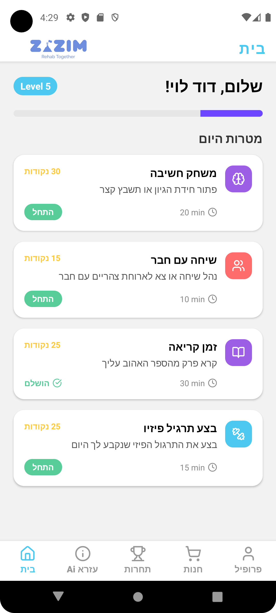
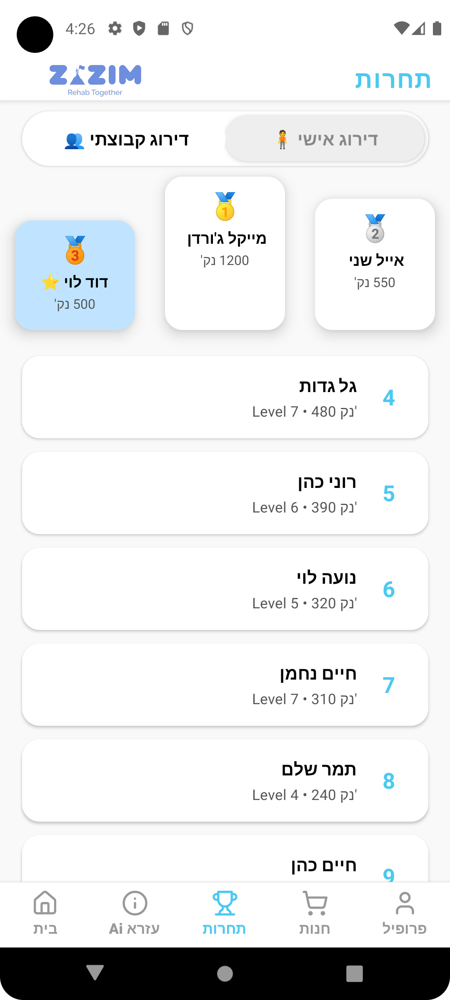
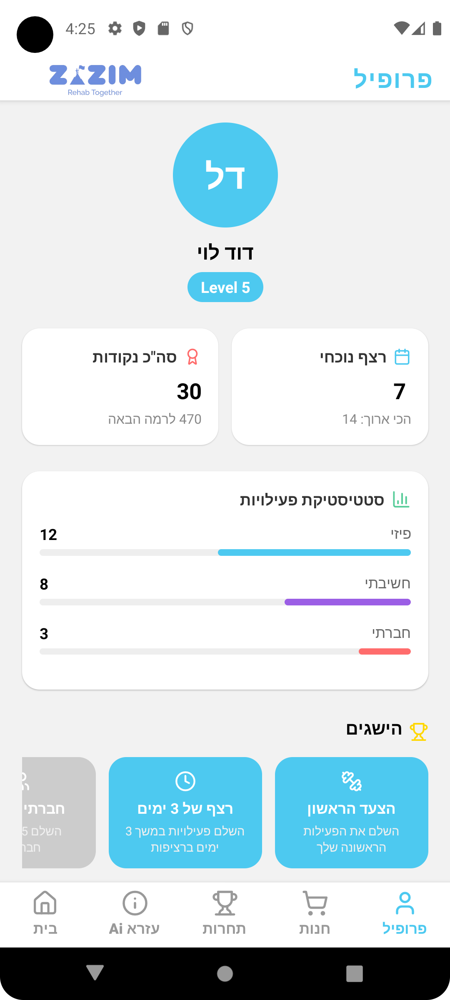

# 🦵 Zazim - Rehab Together

> 🛠️ Built in 24 hours during a hackathon to support injured soldiers returning from war.

## 📱 About the App

Zazim is a gamified rehab companion app designed for soldiers undergoing physical therapy. Inspired by Duolingo, it motivates users to perform and record their physical therapy exercises at home. Through these activities, users earn points and can:

- 🎯 Complete daily rehab missions.
- 🧑‍🤝‍🧑 Join teams to earn bonus points together.
- 🛍️ Use points to “purchase” fun activities from the in-app store.
- 🤖 Use a built-in LLM chatbot to quickly find bureaucratic resources like paperwork, support phone numbers, and relevant articles to simplify post-war rehab.

⚠️ **Note:** This is a concept prototype built in just 24 hours — it's not meant for production or installation. It's a demo of what's possible.

---

## 🧠 Tech Stack

- 
- 
- 
- 
- 
- 

---

## 🖼️ App Screenshots

Here’s a look at the app in action:

| Home Page | Competitions | Daily Tasks | AI Assistant | Rewards Store |
|-----------|--------------|-------------|--------------|----------------|
|  |  |  |  |  |

---
## 👥 Contributors

This project wouldn’t have happened without an amazing team:

- **Naor Guetta** – Full Stack Developer & Vision  
- **Tomer Varsanno** – Project Lead & GitHub Repo: [@T-Varsanno](https://github.com/T-Varsanno)  
- **Michaella Eilat** – UX/UI Design & Chatbot Logic  
- **Itay Saban** – Motion & Backend Integration  

---

